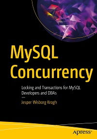

# Apress Source Code

This repository accompanies [*MySQL Concurrency*](https://www.apress.com/9781484266519) by Jesper Wisborg Krogh (Apress, 2021).

[comment]: #cover

Download the files as a zip using the green button, or clone the repository to your machine using Git.

## Releases

Release v1.2 updates the URL for downloading the world database and the path within the ZIP file after it has been updated on downloads.mysql.com. Thanks to shalk (xiao kun) for the patch and black-lotus (Dondon) for a similar patch.

Release v1.1 fixes the directory structure, adds missing files for chapters 2, 13, 15, 16, 17, 18, and adds error message when using `concurrency_book.generate.load()` with the classic MySQL protocol.

Release v1.0 corresponds to the code in the published book, without corrections or updates.

## Contributions

See the file Contributing.md for more information on how you can contribute to this repository.
